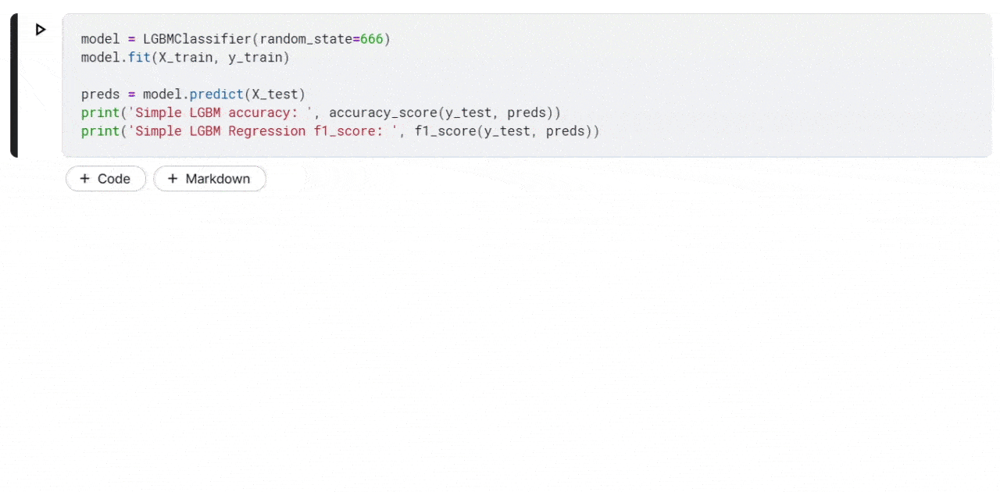

<p align="center">

</p>

<p align="center">
  
  
  <a href="https://app.fossa.com/projects/git%2Bgithub.com%2Faporia-ai%2Fmlnotify?ref=badge_shield" alt="FOSSA Status"></a>
  
  <a href="https://github.com/aporia-ai/mlnotify/issues"></a>
  

  <!-- The Netlify badge is disabled since it's bugged. For more details: -->
  <!-- https://answers.netlify.com/t/status-badge-incorrectly-shows-failing-when-deploy-is-auto-cancelled/7316/26 -->
  <!-- <a href="https://app.netlify.com/sites/mlnotify/deploys" alt="Website Deploy Status"></a> -->
</p>

No need to keep checking your training. Add <strong>just 1 import line</strong> and MLNotify will let you know the second it's done.

**Features:**

- Just `pip install mlnotify` and `import mlnotify` to get started
- Out-of-the-box email & push notifications on desktop, mobile
- Support for most major ML frameworks (as in Keras, LightGBM, SKLearn, XGBoost, Tensorflow)
- A simple & intuitive UX
- Fully secure - no data ever leaves your machine

<p align="center">Made with :heart: by <a href="https://aporia.com" target="_blank">Aporia</a></p>

<p align="center">

</p>
## Quickstart

```bash
pip3 install mlnotify
```

```python
# STEP 1: Import package
import mlnotify

# STEP 2: Do your thing.
my_model.fit(...)

# STEP 3: Browse to mlnotify.com and get notified when training is done!
```

The import will automagically hook into your fit/train method.
- Once you start training your model a tracking url & QR code will be printed to the console.
  
- Enter the tracking url
- Grab a coffee and relax, the tracking url will notify you when the training is complete via desktop, mobile, or email notifications

## Usage

### Simple

`import mlnotify`

This will automagically hook into your fit/train method.

Supported ML frameworks:

- [Keras](https://keras.io/)
- [LightGBM](https://github.com/microsoft/LightGBM)
- [SKLearn](http://scikit-learn.org/stable/)
- [XGBoost](https://xgboost.readthedocs.io/en/latest/) (partially)
- [Tensorflow](https://www.tensorflow.org/)

### Manual

The library also exports a manual API to be used if you want to do it manually.

```python
import mlnotify

mlnotify.start() # Start tracking
# ...
mlnotify.end() # End tracking
```

### Advanced

The library uses a simple plugin architecture. You can register your own plugins to extend the library's functionality.

```python
from mlnotify import BasePlugin, plugin_manager

# A plugin is simply a class with `before` and `after` methods
class MyPlugin(BasePlugin):
    def before(self, *args, **kwargs):
        # Called before the fit/train method
        print("MyPlugin: training started")

    def after(self, *args, **kwargs):
        # Called after the fit/train method
        print("MyPlugin: training finished")

plugin_manager.register_plugin(MyPlugin())

# Use mlnotify as you normally would
model.fit(...)
```

## API

The library exports four items:
```python
from mlnotify import start, end, plugins_manager, BasePlugin
```
### `start() -> None`

Starts tracking.
### `end() -> None`

Ends tracking.

### `plugins_manager: PluginsManager`

The class handling all plugin registration and invokation.
Methods:

- `plugins_manager.register_plugin(plugin: BasePlugin) -> None`

  Registers a plugin.

- `plugins_manager.clear_plugins() -> None`

  Removes all registered plugins.

## Security
The library is fully secure - no data is ever sent to the server.

## Contribution, self-deployment & local development
Contributions and self-deployments are more than welcome.
### Website & API

This project relies heavily on SaaS products, and must receive proper config for Netlify, Firebase and SendGrid for it to work. You can run this project locally using the Netlify CLI:

- Make sure you installed the Netlify CLI globally: `npm install -g netlify-cli`
- You must have the following environment variables set:
  - `FIREBASE_SERVER_CERT` - a stringified JSON containing the firebase server config (it contains the following keys: {type, project_id, private_key_id, private_key, client_email, client_id, auth_uri, token_uri, auth_provider_x509_cert_url, client_x509_cert_url})
  - `GRIDSOME_FIREBASE_APP_CONFIG` - a stringified JSON containing the firebase client config (it contains the following keys: {apiKey, projectId, messagingSenderId, appId})
  - `SENDGRID_API_KEY` - a string containing the SendGrid API Key
- `cd website`
- `netlify dev`

### SDK

- `pip install ./sdk`
- Write a python file using the SDK and just `import mlnotify`

## License

[](https://app.fossa.com/projects/git%2Bgithub.com%2Faporia-ai%2Fmlnotify?ref=badge_large)
